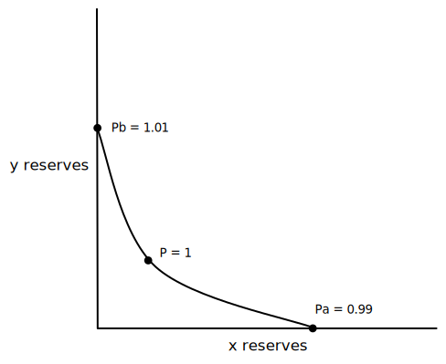

This series will be an *attempt* to provide the perfect mix between understanding the math behind V3 and also not getting lost in the details so you can still get a high-level grasp of how the protocol works. I am, by no means, an expert on Uniswap V3. I am, by no means, an expert in Uniswap V3, but hopefully by the end of it you'll know a little bit more about the juicy bits that make Uniswap V3 so different from V2.

### Motivation

After the release of Uniswap V2, [researchers](https://twitter.com/danrobinson/status/1374462316348010502?s=20) realized the lack of capital efficiency in some of the liquidity pools, especially in pools that didn't fluctuate much in price, such as a DAI/USDC pair.

To illustrate the capital inefficiency, here is an example of a V2 pool between 2 stablecoins where the price consistently fluctuates between $0.99$ and $1.01$.

Using the standard $x \cdot y = k$ curve from V2, we can say:

$x = 1,000,000$

$y = 1,000,000$

$k = 1,000,000 \cdot 1,000,000 = 10^{12}$

In this example, the current price of the pool is $\displaystyle\frac{y}{x} = \displaystyle\frac{1,000,000}{1,000,000} = 1$. This is the price of one $x$ token denominated in $y$ tokens. 

To see the $\Delta x$ (or, change in $x$) that is needed to be added to the pool to push the price down to $0.99$, we start by assuming the price is already at $\displaystyle\frac{x}{y} = 0.99$ and that $k = 10^{12}$. Then, new $x$ and $y$ values can be derived from here.

---

Isolate $\displaystyle\frac{y}{x}$ and $k$ to one side:

$$
x \cdot y = k \longrightarrow y = \frac{k}{x} \longrightarrow  y \cdot y = k \cdot \frac{y}{x}
$$

Plug in values to solve for $y$:

$$
y^{2} = 0.99 \cdot 10^{12} \longrightarrow y = \sqrt{0.99 \cdot 10^{12}} \longrightarrow y = 994,987.44
$$

Solve for $x$:

$$
x \cdot 994,987.44 = 10^{12} \longrightarrow x = 1,005,037.81
$$

The result is that an incoming $\Delta{x}$ of $5,037.81$ tokens to the pool and an outgoing $\Delta{y}$ of $-5,012.56$ tokens from the pool is needed to drop the pool's price from $1$ to $0.99$. Meaning, only $5012.56$ of the pool's $1,000,000$ $y$ tokens were needed by the pool to cover a price drop to $0.99$, which is only ~$0.5\%$ $(\frac{5,012.56}{1,000,000})$ of the $y$ tokens. 

$99.5\%$ of the tokens were unnecessary...

### Fixing capital inefficiency

If $1,000,000$ $y$ tokens are in the pool, it would be better that all $1,000,000$ $y$ tokens be swapped out before the price drops to $0.99$. Similarly, it would be better that all $1,000,000$ $x$ tokens be swapped out before the price rises to $1.01$.

To enable this behavior, two new features are needed: the ability for LPs (liquidity providers) to deposit liquidity between any two prices they see fit, and that the AMM (automated market maker) offers a $x \cdot y = k$ pricing curve between any two prices where an LP has deposited their liquidity. 

With the addition of these features, a central limit order book is introduced into the AMM. Rather than having traditional market makers create single-price limit orders, LPs will create ranged-price limit orders. And rather than the price skipping up and down due to bid/ask spreads, prices instead smooth out using a $x \cdot y = k$ curve between the lower and upper price of a ranged-price limit order. It does, however, require active management of LP positions, which is something that was not necessary in uniswap V2.

So, how does V2's $x \cdot y = k$ curve evolve to support the addition of these new features in V3?

### A new kind of curve

Specifically, the goal for V3 is to have a $x \cdot y = k$ curve where two prices, $P_{a}$ and $P_{b}$, are specified as lower and upper bounds for the curve.

With this new curve, when y tokens are completely exhausted from the pool, the price will be $P_{a}$. When x tokens are completely exhausted from the pool, the price will be $P_{b}$.

---

In a V2 stablecoin pair, prices tend to hover between $0.99$ and $1.01$, but it allowed for the possibility of any price between $0$ and $\infty$ to be quoted because the curve is unbounded.

---

In V3, the curve forces trades to take place between prices $P_{a}$ and $P_{b}$.

V3 uses the original $x \cdot y = k$ function as a base to create a new bounded-curve function:

$$
(x + \frac{L}{\sqrt{P_{b}}})(y + \frac{L}{\sqrt{P_{a}}}) = L^{2}
$$

The following sections will describe how this new function is derived.
