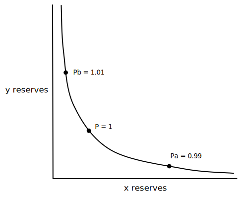

This series will be an *attempt* to provide the perfect mix between understanding the math behind V3 and also not getting lost in the details so you can still get a high-level grasp of how the protocol works. I am by no means an expert on Uniswap V3, but hopefully by the end of it you'll know a little bit more about the juicy bits that make Uniswap V3 so different from V2.

### Motivation

After the release of Uniswap V2, [researchers](https://twitter.com/danrobinson/status/1374462316348010502?s=20) realized the lack of capital efficiency in some of the liquidity pools, especially in pools that didn't fluctuate much in price, such as a DAI/USDC pair.

To illustrate the capital inefficiency, here is an example of a V2 pool between two stablecoins where the price consistently fluctuates between $0.99$ and $1.01$.

Using the standard $x \cdot y = k$ curve from V2, we can say:

$x = 1,000,000$

$y = 1,000,000$

$k = 1,000,000 \cdot 1,000,000 = 10^{12}$

In this example, the current price of the pool is $\displaystyle\frac{y}{x} = \displaystyle\frac{1,000,000}{1,000,000} = 1$. This is the price of one $x$ token denominated in $y$ tokens. 

To see the $\Delta x$ (or, change in $x$) that is needed to be added to the pool to push the price down to $0.99$, we start by assuming the price is already at $\displaystyle\frac{x}{y} = 0.99$ and that $k = 10^{12}$. Then, new $x$ and $y$ values can be derived from here.

---

Isolate $\displaystyle\frac{y}{x}$ and $k$ to one side:

$$
x \cdot y = k \longrightarrow y = \frac{k}{x} \longrightarrow  y \cdot y = k \cdot \frac{y}{x}
$$

Plug in values to solve for $y$:

$$
y^{2} = 0.99 \cdot 10^{12} \longrightarrow y = \sqrt{0.99 \cdot 10^{12}} \longrightarrow y = 994,987.44
$$

Solve for $x$:

$$
x \cdot 994,987.44 = 10^{12} \longrightarrow x = 1,005,037.81
$$

The result is that an incoming $\Delta{x}$ of $5,037.81$ tokens to the pool and an outgoing $\Delta{y}$ of $-5,012.56$ tokens from the pool are needed to drop the pool's price from $1$ to $0.99$. Meaning, only $5012.56$ of the pool's $1,000,000$ $y$ tokens were needed by the pool to cover a price drop to $0.99$, which is only ~$0.5\%$ $(\frac{5,012.56}{1,000,000})$ of the $y$ tokens. 

$99.5\%$ of the tokens were unnecessary...

### Fixing capital inefficiency

If $1,000,000$ $y$ tokens are in the pool, it would be better that all $1,000,000$ $y$ tokens be swapped out before the price drops to $0.99$. Similarly, it would be better that all $1,000,000$ $x$ tokens be swapped out before the price rises to $1.01$.

To enable this behavior, two new features are needed: the ability for LPs (liquidity providers) to deposit liquidity between any two prices they see fit, and that the AMM (automated market maker) offers a $x \cdot y = k$ pricing curve between any two prices where an LP has deposited their liquidity. 

With the addition of these features, a central limit order book is introduced into the AMM. Rather than having traditional market makers create single-price limit orders, LPs will create ranged-price limit orders. And rather than the price skipping up and down due to bid/ask spreads, prices instead smooth out using a $x \cdot y = k$ curve between the lower and upper price of a ranged-price limit order. It does, however, require active management of LP positions, which is something that was not necessary in uniswap V2.

So, how does V2's $x \cdot y = k$ curve evolve to support the addition of these new features in V3?

### A new kind of curve

Specifically, the goal for V3 is to have a $x \cdot y = k$ curve where two prices, $P_{a}$ and $P_{b}$, are specified as lower and upper bounds for the curve.

With this new curve, when $y$ tokens are completely exhausted from the pool, the price will be $P_{a}$. When $x$ tokens are completely exhausted from the pool, the price will be $P_{b}$.

---

In a V2 stablecoin pair, prices tend to hover between $0.99$ and $1.01$, but it allowed for the possibility of any price between $0$ and $\infty$ to be quoted because the curve is unbounded.

---

In V3, the curve forces trades to take place between prices $P_{a}$ and $P_{b}$.

V3 uses the original $x \cdot y = k$ function as a base to create a new bounded-curve function:

$$
(x + \frac{L}{\sqrt{P_{b}}})(y + L \cdot \sqrt{P_{a}}) = L^{2}
$$

The following sections will describe how this new function is derived, which is introduced in the whitepaper.

### Breaking down the x ⋅ y = k curve from V2

In V2, all $x$ reserves would have to be depleted from the pool to reach the highest price on the curve, which would approach infinity. But in V3, we say the upper price bound is just $P_{b}$.

So if $P$ is the current price, then the pool only has to reduce by $x_{real}$ amount of $x$ tokens to reach the price $P_{b}$. And at that price $P_{b}$, $x'$ is the amount of $x$ tokens remaining in the pool.

But because we decided $P_{b}$ would be the absolute max price for this pool, those remaining $x'$ tokens are not needed. Those $x'$ tokens would only be used to trade between prices $P_{b}$ and $\infty$, so we have no use for them in this new pool design.

In V3, those $x'$ reserves are considered "virtual" and do not need to be provided by LPs. The $x'$ number only exists in the math so that the $x \cdot y = k$ curve can hold, where $x = x_{real} + x'$.

The same can be said in the opposite direction for $P_{a}$, $y_{real}$, and $y'$.

---

To recap:

$x'$: number of $x$ tokens in the pool that would make the price $P_{b}$

$y'$: number of $y$ tokens in the pool that would make the price $P_{a}$

$x_{real}$: amount of $x$ tokens in the pool that, when removed, would move the price from $P$ to $P_{b}$

$y_{real}$: amount of $y$ tokens in the pool that, when removed, would move the price from $P$ to $P_{a}$

Looking at the chart, we can see that the $x'$ and $x_{real}$ line segments add up to $x$. This means that LPs only contribute $x_{real}$, and when combined with the virtual $x'$ number, it adds up to the full $x$ value that is used in $x \cdot y = k$.

As another abstraction, V3 swaps out the $k$ value for $L^{2}$ (this will be explained later). Instead of the function $x \cdot y = k$, we insert our modifications and get:

$$
(x_{real} + x')(y_{real} + y') = L^{2}
$$

### Calculating x' and y'

To complete the V3 curve derivation, the only remaining task is to calculate $x'$ and $y'$. To do that, we must look at our new curve as $x \cdot y = L^{2}$ where we already know $x = x_{real} + x'$ and $y = y_{real} + y'$.

V3 does not store global $x$ and $y$ values like it did in V2. Instead, V3 elects to store a global $L$ and $\sqrt{P}$ value for each pool. The reasoning that Uniswap offers for this is that at any one time, only one of the values of $L$ or $\sqrt{P}$ can change, which helps prevent rounding errors. Price ($\sqrt{P}$) only changes with a swap between ticks, and $L$ changes when crossing ticks.

Using $x \cdot y = L^{2}$ and $P = \displaystyle\frac{y}{x}$, values for $x$ and $y$ can be calculated purely in terms of $L$ and $\sqrt{P}$.

---

Solving for $x$:

$$
x \cdot y = L^{2} \longrightarrow x = \frac{L^{2}}{y}
$$

we know that $y = P \cdot x$, so substitute it in:

$$
x = \frac{L^{2}}{P \cdot x}
$$

Put $x$ on one side:

$$
x^{2} = \frac{L^{2}}{P}
$$

Take square root:

$$
x = \frac{L}{\sqrt{P}}
$$

---

Solving for $y$:

$$
x \cdot y = L^{2} \longrightarrow y = \frac{L^{2}}{x}
$$

we know that $x = \displaystyle\frac{y}{P}$, so substitute it in:

$$
y = \frac{L^{2}}{\frac{y}{P}} = L^{2} \cdot \frac{P}{y} = \frac{L^{2} \cdot P}{y}
$$

Put $y$ on one side:

$$
y^{2} = L^{2} \cdot P
$$

Take square root:

$$
y = L \cdot \sqrt{P}
$$

By storing $L$ and $\sqrt{P}$ globally, it makes it trivially easy to calculate $x$ and $y$. If $L^{2}$ and $P$ were stored instead, each calculation for $x$ and $y$ would have a square root calculation added to it, which hampers efficiency with a smart contract implementation.

---

We now know how to calculate $x$ and $y$ but we still don't know the exact ratio of $x_{real}$ to $x'$ or $y_{real}$ to $y'$ yet.

Looking at the price curve diagram, we can see that at price $P_{b}$, there are zero $x_{real}$ reserves and only the virtual $x'$ reserves remaining. Similarly, at price $P_{a}$, there are zero $y_{real}$ reserves and only the virtual $y'$ reserves remaining. Using this insight, we can finally calculate a value for $x'$ and $y'$.

We know three things about $x$ and $y$:

1\. $x = \displaystyle\frac{L}{\sqrt{P}}$ and $y = L \cdot \sqrt{P}$

2\. $x = x_{real} + x'$ for some price $P$, $y = y_{real} + y'$ for some price $P$

3a\. At price $P_{b}$, $x_{real}$ reserves are zero, so $x = x_{real} + x' = 0 + x' = x'$

3b\. At price $P_{a}$, $y_{real}$ reserves are zero, so $y = y_{real} + y' = 0 + y' = y'$

Putting this together, we can see that for the two specific prices, $P_{b}$ and $P_{a}$:

$$
x' = \frac{L}{\sqrt{P_{b}}}
$$

$$
y' = L \cdot \sqrt{P_{a}}
$$

### Conclusion

Knowing how $x'$ and $y'$ are calculated, we plug them into our function:

$$
(x_{real} + \frac{L}{\sqrt{P_{b}}})(y_{real} + L \cdot \sqrt{P_{a}}) = L^{2}
$$

And now we finally reach equation 2.2 from the [Uniswap V3 whitepaper](https://uniswap.org/whitepaper-v3.pdf).