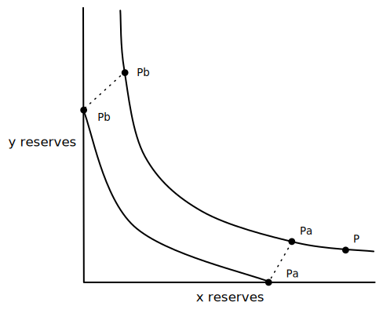
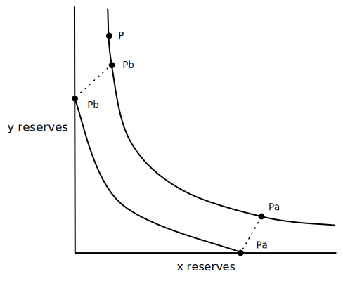
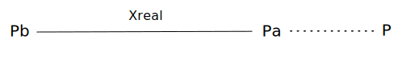
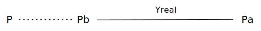
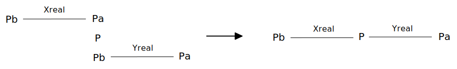
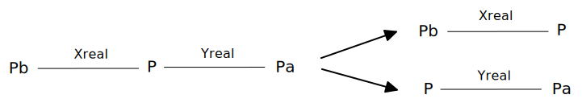

### Motivation

When providing liquidity on V3, an LP doesn't necessarily have to provide an equivalent amount of $x$ and $y$ tokens like how it was with V2. What an LP provides depends on the price range they specify and where the range is relative to the current price.

Each position that an LP creates is a mapping from an account address, lower bound, and upper bound to a liquidity value $L$. This liquidity will be combined later on, when the price crosses this particular LP's range, with all the other LPs to create a global $L$ value for swaps. 

So, depending on the range specified by the LP relative to the current price P, There are three different ways to compute this $L$ value, and therefore, how much of each $x$ and $y$ token to deposit.

1\. $P \leq P_{a}$, current price is below the LP's range

2\. $P_{b} \leq P$, current price is above the LP's range

3\. $P_{a} \le P \le P_{b}$, current price is within the LP's range

For each of these cases, we will see how much of token $x$ and token $y$ that an LP has to deposit when they specify some $P_{a}$ and $P_{b}$

### Calculate L when $P \leq P_{a}$

Here, we have a graph where $P$ is below $P_{a}$:

From Part 1 in this series, we know that $y_{real}$ reserves become $0$ when the price reaches or exceeds $P_{a}$. So, for any price at $P_{a}$ or below, there are $0 y_{real}$ tokens in the LP position for this range. 

---

To solve for $L$, we take our concentrated liquidity function and specify that $y_{real}$ is 0 when $P \leq P_{a}$:

$$
(x_{real} + \frac{L}{\sqrt{P_{b}}})(0 + L \sqrt{P_{a}}) = L^{2} \longrightarrow (x_{real} + \frac{L}{\sqrt{P_{b}}})(L \sqrt{P_{a}}) = L^{2}
$$

Cancel out an $L$ on each side:

$$
(x_{real} + \frac{L}{\sqrt{P_{b}}}) \cdot \sqrt{P_{a}} = L
$$

Multiply out $\sqrt{P_{a}}$:

$$
x_{real} \cdot \sqrt{P_{a}} + L \cdot \frac{\sqrt{P_{a}}}{\sqrt{P_{b}}} = L
$$

Move $L$ to one side:

$$
x_{real} \cdot \sqrt{P_{a}} = L - L \cdot \frac{\sqrt{P_{a}}}{\sqrt{P_{b}}} 
$$

Divide both sides by $\sqrt{P_{a}}$:

$$
x_{real} = \frac{L}{\sqrt{P_{a}}} - L \cdot \frac{\sqrt{P_{a}}}{\sqrt{P_{b}} \cdot \sqrt{P_{a}}}
\longrightarrow
x_{real} = \frac{L}{\sqrt{P_{a}}} - \frac{L}{\sqrt{P_{b}}} 
$$

Factor out the binomial:

$$
x_{real} = \frac{L}{\sqrt{P_{a}}} \cdot \frac{\sqrt{P_{b}}}{\sqrt{P_{b}}} - \frac{L}{\sqrt{P_{b}}} \cdot \frac{\sqrt{P_{a}}}{\sqrt{P_{a}}}
\longrightarrow
x_{real} = L \cdot \frac{\sqrt{P_{b}} - \sqrt{P_{a}}}{\sqrt{P_{b}} \cdot \sqrt{P_{a}}}
$$

Solve for $L$ by cross multiplication:

$$
\frac{x_{real}}{L} = \frac{\sqrt{P_{b}} - \sqrt{P_{a}}}{\sqrt{P_{b}} \cdot \sqrt{P_{a}}}
\longrightarrow
L \cdot (\sqrt{P_{b}} - \sqrt{P_{a}}) = x_{real} \cdot (\sqrt{P_{b}} \cdot \sqrt{P_{a}})
$$

Finally:

$$
L = x_{real} \cdot \frac{\sqrt{P_{b}} \cdot \sqrt{P_{a}}}{\sqrt{P_{b}} - \sqrt{P_{a}}}
$$

We can see that calculating liquidity to provide only requires the deposit of $x_{real}$ tokens by the LP when price $P$ is below $P_{a}$.

### Calculate L when $P_{b} \leq P$

Here, we have a graph where $P$ is above $P_{b}$:

From Part 1 in this series, we know that $x_{real}$ reserves become 0 when the price reaches or exceeds $P_{b}$. So, for any price at $P_{b}$ or higher, there are 0 $x_{real}$ tokens in the LP position for this range.

---

To solve for $L$, we take our concentrated liquidity function and specify that $x_{real}$ is $0$ when $P_{b} \leq P$:

$$
(0 + \frac{L}{\sqrt{P_{b}}})(y_{real} + L \sqrt{P_{a}}) = L^{2}
\longrightarrow
\frac{L}{\sqrt{P_{b}}} \cdot (y_{real} + L \sqrt{P_{a}}) = L^{2}
$$

Cancel out an $L$ on each side:

$$
\frac{1}{\sqrt{P_{b}}} \cdot (y_{real} + L \sqrt{P_{a}}) = L
$$

Multiply out $\frac{1}{\sqrt{P_{b}}}$:

$$
\frac{y_{real}}{\sqrt{P_{b}}} + L \cdot \frac{\sqrt{P_{a}}}{\sqrt{P_{b}}} = L
$$

Move $L$ to one side:

$$
\frac{y_{real}}{\sqrt{P_{b}}} = L + L \cdot \frac{\sqrt{P_{a}}}{\sqrt{P_{b}}}
$$

Multiply both sides by $\sqrt{P_{b}}$:

$$
y_{real} = L \cdot \sqrt{P_{b}} - L \cdot \frac{\sqrt{P_{a}} \cdot \sqrt{P_{b}}}{\sqrt{P_{b}}}
\longrightarrow
y_{real} = L \cdot \sqrt{P_{b}} - L \cdot \sqrt{P_{a}}
$$

Pull $L$ out of the binomial:

$$
y_{real} = L \cdot (\sqrt{P_{b}} - \sqrt{P_{a}})
$$

Finally: 

$$
L = \frac{y_{real}}{\sqrt{P_{b}} - \sqrt{P_{a}}}
$$

We can see that calculating liquidity to provide only requires the deposit of $y_{real}$ tokens by the LP when price $P$ is above $P_{b}$.

### Calculate L when $P_{a} \le P \le P_{b}$

Here, we have a graph when $P$ is between $P_{a}$ and $P_{b}$.

The goal here to determine the ratio of $x$ and $y$ tokens to deposit for the specified range, $P_{a}$ and $P_{b}$.

--- 

We know that when $P$ is below $P_{a}$, the range only has $x_{real}$ tokens as liquidity:

And we also know that when $P$ is above $P_{b}$ the range only has $y$ tokens in it: 

If we combine these two examples, we can see that to the left of $P$ only exists $x$ tokens and to the right only $y$ tokens.

The intuition here is that any range, where $P$ is inside $P_{a}$ and $P_{b}$, can be split up into two sub-ranges, with one only containing $x_{real}$ tokens and one only containing $y_{real}$  tokens:

Since we have already solved for $L$ in both cases where a range has oly $x_{real}$ tokens or only $y_{real}$ tokens, we can also solve for this case.

---

We start with our liquidity calculation for $L$ in a range with only $x_{real}$ tokens:

$$
L = x_{real} \cdot \frac{\sqrt{P_{b}} \cdot \sqrt{P_{a}}}{\sqrt{P_{b}} - \sqrt{P_{a}}}
$$

Since we know the range $P_{b}$ to $P$ only has $x_{real}$ tokens, we use this range instead:

$$
L = x_{real} \cdot \frac{\sqrt{P_{b}} \cdot \sqrt{P}}{\sqrt{P_{b}} - \sqrt{P}}
$$

Now that we have an $L$ value, we can use it to solve for $y_{real}$. We'll use the range $P$ to $P_{a}$ since we know it only has $y_{real}$ tokens:

$$
L = \frac{y_{real}}{\sqrt{P_{b}} - \sqrt{P_{a}}}
\longrightarrow
L = \frac{y_{real}}{\sqrt{P} - \sqrt{P_{a}}}
$$

Solve for $y_{real}$:

$$
y_{real} = L \cdot (\sqrt{P} - \sqrt{P_{a}})
$$

So, given $x_{real}$ as input, we can calculate the $L$ value, then use $L$ to solve for $y_{real}$. Using the $L$ value from the $x_{real}$ calculation works on the $y_{real}$ side because on either side of $P$, there is expected to be $L$ liquidity. This is the case because the entire range has $L \cdot L = L^{2}$ as its constant product. 

This process is how V3 calculates how much of each token that an LP should provide. An LP specifies a range, enters an amount of token $x$, and based on the current price, a $y$ amount of the token is specified to deposit as well. 

### Let's see an example

An LP is adding a $\Delta x$ of $2$ ETH in a ETH/DAI pool. ETH's current price is $P = 2000$, and the LP has specified the range from $P_{a} = 1500$ to $P_{b} = 2500$. How much DAI does the LP need to add along with the $2$ ETH?

With $P_{b}$ to $P$ as our range and $x_{real}$ set as $2$, we can calculate how much liquidity will be added to the pool:

$$
L = x_{real} \cdot \frac{\sqrt{P_{b}} \cdot \sqrt{P}}{\sqrt{P_{b}} - \sqrt{P}} = 
2 \cdot \frac{\sqrt{2500} \cdot \sqrt{2000}}{\sqrt{2500} - \sqrt{2000}} = 847.2136
$$

With our new $\Delta L$ value, we can calculate how much $y_{real}$ the LP will be expected to add, with a range of $P$ to $P_{a}$:

$$
y_{real} = L \cdot (\sqrt{P} - \sqrt{P_{a}}) = 847.2136 \cdot (\sqrt{2000} - \sqrt{1500}) = 5076.1
$$

To provide liquidity in a range from $1500$ to $2500$ with $2$ ETH, the LP would need to deposit $5076.1$ DAI as well.